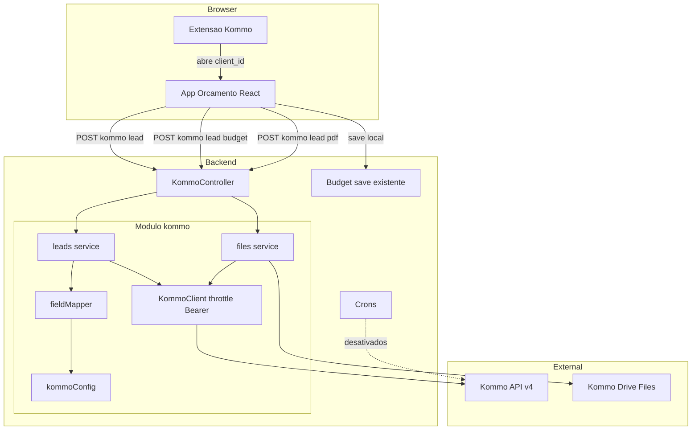
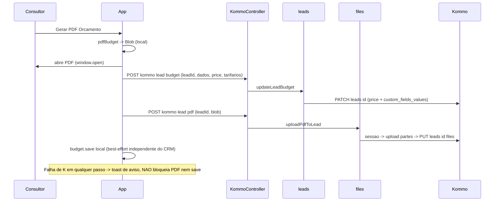
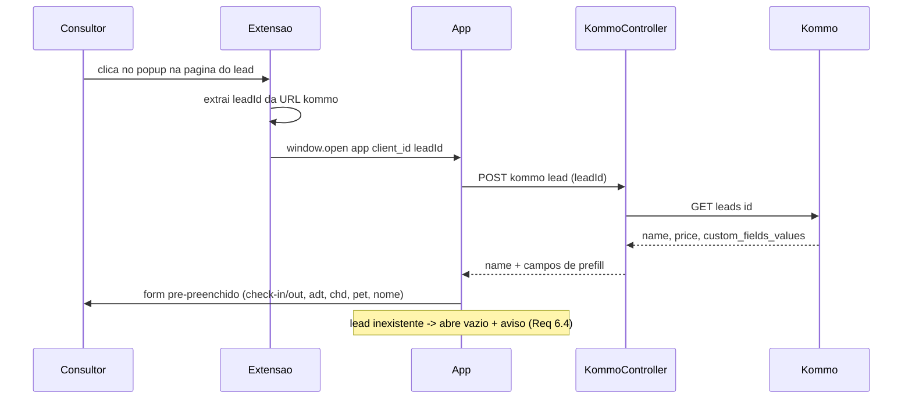
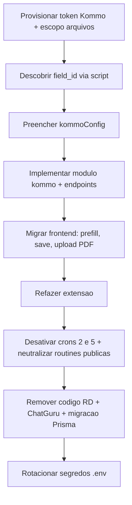

# Design Document — migracao-crm-kommo

## Overview

**Propósito**: substituir a integração de CRM do sistema de orçamento (legado React + Node) de **RD Station** para **Kommo**, mantendo os dois fluxos operacionais — alimentar o lead ao salvar o orçamento (PUSH) e abrir o orçamento pré-preenchido a partir de um lead (PULL via extensão) — e adicionando a anexação do **PDF do orçamento** ao lead.

**Usuários**: consultores comerciais (geram/salvam orçamentos e abrem orçamentos a partir do CRM) e o administrador do sistema (provisiona o token e configura o mapeamento de campos).

**Impacto**: remove todo o acoplamento ao RD Station (auth por `?token=`, IDs de campo/etapa hardcoded, tokens por usuário, produtos de deal e a chamada inline ao ChatGuru) e introduz um módulo `kommo` no backend que centraliza auth Bearer, mapeamento de campos e a Files API. O valor do orçamento passa a viver no campo nativo `price` do lead e os tarifários usados em um custom field; a troca de etapa do pipeline deixa de ser feita pelo sistema.

### Goals
- Escrever os dados do orçamento (datas, ocupação, valor, tarifários) no lead do Kommo nos fluxos de hospedagem e corporativo.
- Anexar o PDF do orçamento ao lead via Files API no momento da geração do PDF.
- Pré-preencher o orçamento a partir dos dados do lead, acionado pela extensão.
- Autenticação por token único de longa duração, sem credenciais por usuário e sem token no cliente.
- Desativar os crons que escrevem no RD e remover código/segredos do RD e do ChatGuru.

### Non-Goals
- Troca de etapa do lead no pipeline (passa a ser manual no Kommo).
- Reimplementação no Kommo das automações de cron (apenas desativação).
- Espelhamento de produtos de catálogo (substituído por `price` + custom field de tarifários).
- Integração ChatGuru (descontinuada) e camada de abstração `CrmAdapter` (fica para o rebuild futuro).
- Renomear as chaves `rd_client`/`idClient` no JSON salvo dos orçamentos (mantidas para evitar migração de dados).

## Boundary Commitments

### This Spec Owns
- O **módulo `kommo`** no backend: cliente HTTP Bearer com throttle, configuração de subdomínio/token, mapa de campos personalizados, leitura/escrita de lead e upload de PDF (Files API).
- Os **endpoints `/kommo/*`** consumidos pelo frontend (ler lead, atualizar lead com dados do orçamento, anexar PDF).
- A reescrita dos fluxos de frontend que hoje chamam o RD: salvar orçamento no lead, pré-preencher a partir do lead, e exposição do blob do PDF para upload.
- A **extensão `rd-plugin/`** refeita: extrair o lead-id da URL do Kommo e abrir o app pré-preenchido.
- A **desativação** dos crons RD ativos (#2, #5) e a **remoção** do código/config/segredos do RD Station e da chamada ChatGuru no fluxo de salvar.
- A migração de schema que remove `User.token_rd`/`User.user_rd`.

### Out of Boundary
- Troca de etapa do lead, automações de cron reimplementadas, mensageria (ChatGuru/Kommo messaging).
- Crons que não tocam CRM (`#6 Google Forms`, `#7 App Hotel`) — permanecem inalterados.
- Lógica de cálculo de tarifa/orçamento (consumida, não alterada).
- Provisionamento da conta Kommo (token, escopos, IDs de campo) — pré-requisito externo fornecido pelo administrador.

### Allowed Dependencies
- Kommo API v4 (`https://<subdominio>.kommo.com/api/v4`) e Files API (`https://drive.kommo.com`).
- Infra existente: Express/rotas, Prisma/Postgres, axios, geração de PDF `pdfmake`, `authMiddleware`.
- Variáveis de ambiente novas (`KOMMO_*`). **Proibido**: depender do código/config do RD ou do ChatGuru após a migração; expor token do CRM ao cliente.

### Revalidation Triggers
- Mudança no contrato dos endpoints `/kommo/*` (shape de request/response) → revalidar frontend e extensão.
- Mudança nas chaves `rd_client`/`idClient` no JSON do budget → revalidar persistência e qualquer leitura desses paths.
- Mudança no mapa de campos (`kommoConfig.fields`) ou no formato do token/escopos → revalidar PUSH, PULL e upload.
- Mudança no padrão de URL de lead do Kommo → revalidar a extensão.

## Architecture

### Existing Architecture Analysis
- Backend Express com controllers por domínio (`server/src/controllers/*`), serviços (`server/src/services/*`), config (`server/src/config/*`), crons (`server/src/crons/*`), rotas únicas em `routes.ts` (rotas `/rd/*` atrás de `authMiddleware`; `/routines/*` **públicas**).
- O RD vaza em todas as camadas e há **dois caminhos de auth** (env token nos services; `token_rd`/`user_rd` por usuário no `RDController`). IDs de campo duplicados em config, controller, `winChange` e extensão.
- Frontend React/Vite: `hooks/api/all/rd.api.ts` (4 métodos), `context/generateTariff/functions/rdSaveProcess.ts`, prefill por query-params, `useClientName`, geração de PDF em `pdfBudget.ts` (hoje só `window.open`).
- Persistência: o id do deal vive **dentro do JSON** do budget (`saveBudgets[0].arrComplete.responseForm.rd_client`, `saveBudgetsCorp.idClient`).

### Architecture Pattern & Boundary Map



**Decisões-chave**:
- **Naming limpo `kommo`** (substitui `rdstation`): como produtos e troca de etapa saíram, o contrato antigo (`changeStage`/`addProduct`/`deleteProduct`) mudaria de toda forma; um módulo novo limpo + remoção do RD atende a Req 9 sem deixar nomes enganosos.
- **Plugin sem token e sem chamada autenticada**: o plugin apenas extrai o lead-id e abre o app; o **app autenticado** faz a leitura do lead. O token nunca sai do servidor e o endpoint de leitura fica protegido por `authMiddleware`.
- **Cliente único + mapeador**: toda chamada Kommo passa por `KommoClient` (Bearer + throttle 7 req/s) e o mapeamento de campos vive só em `kommoConfig`/`fieldMapper` (fim da duplicação de IDs).
- **Dependency direction**: `types → config → client → (leads, files, mapper) → controller → routes`. Frontend: `kommo.api → hooks/functions → components`. Imports só para a esquerda.

### Technology Stack

| Layer | Choice / Version | Role in Feature | Notes |
|-------|------------------|-----------------|-------|
| Frontend | React 18 + Vite + axios | Pré-preenchimento, salvar no lead, upload de PDF | Substitui `rd.api.ts` por `kommo.api.ts` |
| Backend | Node + Express + TypeScript + axios | Módulo `kommo`, endpoints `/kommo/*` | Bearer header (não `?token=`) |
| Rate limit | `bottleneck` (^2) ou throttle equivalente | Manter ≤7 req/s no `KommoClient` | Nova dependência leve; alternativa: fila própria |
| Upload | `multer` (^1) — **nova dependência** | Receber o blob do PDF no endpoint | Confirmado: backend **não** tem parser multipart hoje |
| Notificação | MUI `Snackbar`+`Alert` (já há `@mui/material`) ou componente `Message` existente | Avisar "sincronização falhou" (Req 5) | Não há toast global hoje — adicionar um provider/snackbar simples |
| Data | PostgreSQL + Prisma | Remover `User.token_rd`/`user_rd`; manter JSON keys | Migração Prisma |
| External | Kommo API v4 + Drive (Files API) | CRM e anexos | Token long-lived com escopo "Access to files" |

## File Structure Plan

### Directory Structure (novos arquivos — backend)
```
server/src/
├── config/
│   └── kommoConfig.ts          # subdomínio, baseUrl, token, drive; mapa de field_id (preenchido pós-descoberta)
├── services/kommo/
│   ├── kommo.types.ts          # KommoLead, KommoCustomFieldValue, BudgetLeadInput, KommoError
│   ├── kommoClient.ts          # axios Bearer + throttle (7 req/s); cliente do drive
│   ├── fieldMapper.ts          # budget <-> custom_fields_values; readers de leitura
│   ├── leads.ts                # getLead(id), updateLeadBudget(id, input)
│   └── files.ts                # uploadPdfToLead(leadId, buffer, filename)
├── controllers/Kommo/
│   └── KommoController.ts       # getLead, updateBudget, uploadPdf
└── scripts/
    └── kommoDiscoverFields.ts   # admin: GET /leads/custom_fields -> imprime field_id (setup)
```

### Directory Structure (frontend — novos)
```
frontend/src/
├── hooks/api/all/
│   └── kommo.api.ts            # getLead, saveBudgetToLead, uploadBudgetPdf
└── context/generateTariff/
    ├── functions/kommoSaveProcess.ts   # substitui rdSaveProcess(+Corp): 1 chamada updateBudget
    └── hooks/usePrefillFromLead.ts     # ao detectar client_id, busca lead e popula o form
```

### Directory Structure (extensão — refeita)
```
rd-plugin/                       # mantido o diretório; conteúdo refeito
├── manifest.json               # host_permissions p/ <subdominio>.kommo.com; sem permissões a mais
├── index.html / style.css      # popup (reuso)
└── script.js                   # extrai lead-id da URL do Kommo; window.open do app; SEM token, SEM XHR
```

### Modified Files
- `frontend/src/context/generateTariff/functions/pdfBudget.ts` — expor o `Blob` gerado (além do `window.open`) para permitir o upload; sem mudança de layout do PDF.
- `frontend/src/components/ButtonsBudget/use-component-buttons-budget.ts` — reordenar o fluxo: gerar PDF (local) → abrir → best-effort `saveBudgetToLead` → best-effort `uploadBudgetPdf` → `budget.save` local; nome do lead vindo do prefill.
- `frontend/src/context/generateTariff/hooks/useClientName.ts` — passar a usar `kommo.api.getLead` (ou ser absorvido por `usePrefillFromLead`).
- `frontend/src/components/FormOrc/partForm/{rdClient,pipeNumber}.tsx`, `CalendarPicker`, `adult/child/pet` — popular a partir do lead buscado (via hook) mantendo query-param como fallback.
- `server/src/routes.ts` — adicionar rotas `/kommo/*` (atrás de `authMiddleware`); remover `/rd/*`; desregistrar gatilhos `/routines/*` das rotinas #2/#5.
- `server/src/server.ts` — remover registro dos crons `#2 fsAssistDBStatus` e `#5 fsAssistDaysDeadLine`.
- `server/prisma/schema.prisma` (+ migração) — remover `User.token_rd` e `User.user_rd`.
- `server/src/controllers/Users/{CreateUsersController,UpdateUsersController}.ts` + `server/prisma/seeds/users.ts` — parar de gravar `token_rd`/`user_rd`.
- `server/.env.example` / `docker-compose.prod.yml` — trocar `RD_*` por `KOMMO_*`.
- `frontend/src/context/generateTariff/.../calcTotal.ts` (e fluxo de geração) — persistir `tariffsUsed` no objeto de orçamento durante o cálculo.
- `frontend/` (provider de notificação) — Snackbar/`Message` para os avisos de falha de sincronização (Req 5).

### Removed Files
- `server/src/services/rdstation/*`, `server/src/config/rdstationConfig.ts`, `server/src/controllers/RdStation/RDController.ts`, `server/src/services/winChange.ts` (usado só pelos crons removidos).
- `frontend/src/hooks/api/all/rd.api.ts`, `frontend/src/context/generateTariff/functions/rdSaveProcess.ts`.
- Chamada ao ChatGuru no fluxo de salvar (era inline no `changeStage`).

## System Flows

### Fluxo 1 — Gerar orçamento, salvar no lead e anexar PDF (PUSH)

Gating: cada chamada ao Kommo é **best-effort** e isolada em try/catch; o salvamento local do orçamento e a abertura do PDF nunca são bloqueados (Req 5).

### Fluxo 2 — Abrir orçamento pré-preenchido a partir do lead (PULL)


## Requirements Traceability

| Requirement | Summary | Components | Interfaces | Flows |
|-------------|---------|------------|------------|-------|
| 1.1–1.3 | Auth Bearer token único da conta | `kommoClient`, `kommoConfig` | `KommoClient` | 1,2 |
| 1.4 | Remover credenciais RD por usuário | `schema.prisma` migração | — | — |
| 1.5 | Token ausente/inválido → degrada | `kommoClient`, `KommoController` | erro `KommoError` | 1,2 |
| 2.1–2.3 | Mapa de campos + tolerância a ausente | `kommoConfig`, `fieldMapper` | `fieldMapper` | 1,2 |
| 3.1–3.2 | Gravar campos hospedagem/corp | `leads.updateLeadBudget`, `kommoSaveProcess` | `POST /kommo/lead/budget` | 1 |
| 3.3 | Valor (`price`) + tarifários | `fieldMapper`, `leads` | `BudgetLeadInput` | 1 |
| 3.4 | PATCH parcial preserva campos | `leads` | `PATCH leads/{id}` | 1 |
| 3.5 | Sem troca de etapa | `leads` (sem `status_id`) | — | 1 |
| 3.6 | Sem ChatGuru | remoção no save | — | 1 |
| 3.7 | Sem lead → salva normal | `kommoSaveProcess`, buttons hook | — | 1 |
| 4.1–4.4 | Anexar PDF via Files API, token no servidor, escopo | `files`, `KommoController`, `pdfBudget` | `POST /kommo/lead/pdf` | 1 |
| 4.5 | Falha de PDF não bloqueia | buttons hook | — | 1 |
| 5.1–5.4 | Resiliência, log, rate limit | buttons hook, `kommoClient` | throttle | 1 |
| 6.1–6.4 | Prefill a partir do lead | `usePrefillFromLead`, `leads.getLead` | `POST /kommo/lead` | 2 |
| 7.1–7.5 | Extensão abre prefill; token no servidor | `rd-plugin/script.js`, `KommoController` | `POST /kommo/lead` | 2 |
| 8.1–8.4 | Desativar crons RD; manter #6/#7 | `server.ts`, `routes.ts` | — | — |
| 9.1–9.5 | Remover RD + ChatGuru; rotacionar segredos | remoções + `.env` | — | — |

## Components and Interfaces

| Component | Domain/Layer | Intent | Req | Key Dependencies | Contracts |
|-----------|--------------|--------|-----|------------------|-----------|
| KommoClient | Backend/infra | axios Bearer + throttle 7 req/s | 1.1–1.3,1.5,5.4 | axios, bottleneck (External) | Service |
| kommoConfig | Backend/config | subdomínio, token, drive, mapa de field_id | 1.2,2.1 | env (External) | State |
| fieldMapper | Backend/domain | budget ↔ custom_fields_values | 2.1–2.3,3.1–3.3 | kommoConfig (P0) | Service |
| leads | Backend/service | getLead, updateLeadBudget | 3.1–3.5,6.1 | KommoClient (P0), fieldMapper (P0) | Service |
| files | Backend/service | upload + attach PDF | 4.1–4.4 | KommoClient (P0) | Service |
| KommoController | Backend/controller | endpoints `/kommo/*` | 3,4,6,7 | leads (P0), files (P0) | API |
| kommo.api | Frontend/api | wrapper dos `/kommo/*` | 3,4,6 | axios (P0) | Service |
| kommoSaveProcess | Frontend/logic | montar input e chamar saveBudgetToLead | 3.1–3.3,3.7 | kommo.api (P0) | Service |
| usePrefillFromLead | Frontend/hook | buscar lead e popular form | 6.1–6.4 | kommo.api (P0) | State |
| Extensão | Browser | lead-id da URL → abrir app | 7.1–7.5 | — | — |

### Backend

#### KommoClient
| Field | Detail |
|-------|--------|
| Intent | Instância HTTP autenticada e limitada em taxa para toda chamada Kommo |
| Requirements | 1.1, 1.2, 1.3, 1.5, 5.4 |

**Responsibilities & Constraints**
- Criar axios com `baseURL = kommoConfig.baseUrl` e header `Authorization: Bearer <token>`; cliente separado para o drive (`drive.kommo.com`).
- Throttle ≤ 7 req/s (Req 5.4). Normalizar erros HTTP em `KommoError` discriminado.
- **Invariante**: o token só existe no servidor; nunca é retornado em respostas.

**Dependencies**: Outbound: Kommo API/Drive (P0, External). Inbound: leads, files.

**Contracts**: Service ✔
```typescript
type KommoError =
  | { kind: 'auth'; status: 401 | 403 }      // token inválido/sem escopo
  | { kind: 'not_found'; status: 404 }       // lead inexistente
  | { kind: 'rate_limited'; status: 429 }
  | { kind: 'network' }
  | { kind: 'unknown'; status: number };

interface KommoClient {
  get<T>(path: string, params?: Record<string, string>): Promise<T>;
  patch<T>(path: string, body: unknown): Promise<T>;
  putFilesLink(leadId: number, fileUuids: string[]): Promise<void>;
  drivePost<T>(url: string, body: unknown, headers?: Record<string, string>): Promise<T>;
}
```
- Preconditions: `kommoConfig.token` e `baseUrl` presentes; senão lança `KommoError{kind:'auth'}` (Req 1.5).
- Postconditions: respeita o limite de taxa; erros sempre tipados.

#### fieldMapper
| Field | Detail |
|-------|--------|
| Intent | Traduzir entre o orçamento e o formato `custom_fields_values` do Kommo |
| Requirements | 2.1, 2.2, 2.3, 3.1, 3.2, 3.3 |

**Responsibilities & Constraints**
- `toCustomFields(input)` → `custom_fields_values[]` no formato `{field_id, values:[{value}]}` (datas como **unix timestamp**, números como string).
- `readLead(lead)` → extrai cada campo por `field_id`, retornando vazio quando ausente (Req 2.3).
- Não decide regra de negócio do valor; recebe `price` e `tariffs` prontos.

**Contracts**: Service ✔
```typescript
interface BudgetLeadInput {
  checkIn: Date; checkOut: Date;
  adt: number; chdAges: number[]; petSizes: string[];
  price: number;            // -> campo nativo price do lead (Req 3.3). Regra em kommoSaveProcess.
  tariffs: string[];        // -> custom field tariffs_used (Req 3.3). Lista persistida no budget.
}
interface LeadPrefill {
  id: number; name: string;
  checkIn?: string; checkOut?: string;
  adt?: number; chdAges?: number[]; petSizes?: string[];
}
interface FieldMapper {
  toCustomFields(input: BudgetLeadInput): KommoCustomFieldValue[];
  readLead(lead: KommoLead): LeadPrefill;
}
```

#### leads
**Contracts**: Service ✔
```typescript
interface LeadsService {
  getLead(id: number): Promise<LeadPrefill>;                         // GET /leads/{id} (6.1)
  updateLeadBudget(id: number, input: BudgetLeadInput): Promise<void>; // PATCH /leads/{id} price+custom (3.1-3.4)
}
```
- `updateLeadBudget` envia `{ price, custom_fields_values }` — **nunca** `status_id`/`pipeline_id` (Req 3.5). PATCH é parcial (Req 3.4).
- `getLead` resolve `name` + campos de prefill; `404` → propaga `KommoError{kind:'not_found'}` (Req 6.4).

#### files
**Contracts**: Service ✔ / Batch ✔ (upload em partes)
```typescript
interface FilesService {
  uploadPdfToLead(leadId: number, pdf: Buffer, filename: string): Promise<void>;
}
```
- Fluxo: criar sessão no drive → enviar partes (≤ `max_part_size`) → obter `uuid` → `PUT /leads/{leadId}/files` com `[{file_uuid}]` (Req 4.1).
- Idempotência: cada chamada anexa uma nova versão do PDF (aceitável — histórico no lead). Requer escopo "Access to files"; `403` → `KommoError{kind:'auth'}` (Req 4.4).

#### KommoController
**Contracts**: API ✔

| Method | Endpoint | Request | Response | Errors |
|--------|----------|---------|----------|--------|
| POST | `/kommo/lead` | `{ leadId: number }` | `LeadPrefill` | 404 (não encontrado), 502 (CRM) |
| POST | `/kommo/lead/budget` | `{ leadId, budget: BudgetLeadInput }` | `{ ok: true }` | 400, 502 |
| POST | `/kommo/lead/pdf` | multipart: `leadId` + arquivo `pdf` | `{ ok: true }` | 400, 413, 502 |

- Todas atrás de `authMiddleware` (Req 7.5: leitura de lead protegida; token só no servidor).
- Erros de CRM retornam status distinto (502) para o frontend tratar como "sincronização falhou" sem bloquear (Req 5.1–5.2).

**Implementation Notes**
- Integração: `/kommo/lead` substitui `POST /rd/get_a_deal`; `/kommo/lead/budget` substitui `changeStage`+`addProduct`+`deleteProduct`; `/kommo/lead/pdf` é novo.
- Validation: validar `leadId` numérico; limitar tamanho do upload.
- Risks: tamanho do PDF vs `max_file_size`; throttle sob múltiplos uploads simultâneos.

### Frontend

#### kommo.api / kommoSaveProcess / usePrefillFromLead
**Contracts**: Service ✔ / State ✔
```typescript
interface KommoApi {
  getLead(leadId: number): Promise<LeadPrefill>;
  saveBudgetToLead(leadId: number, budget: BudgetLeadInput): Promise<void>;
  uploadBudgetPdf(leadId: number, pdf: Blob, filename: string): Promise<void>;
}
```
- `kommoSaveProcess(budgets, group)` e `...Corp(budget)`: derivam `BudgetLeadInput` e chamam `saveBudgetToLead`. Substituem `rdSaveProcess`/`Corp` — sem produtos, sem etapa. Regras de derivação:
  - **`price` (Req 3.3)**: o app já distingue **simples vs grupo** (flag `group`). `group === true` → **soma** dos `total.total` de todos os budgets do grupo; `group === false` (simples) → o **mais barato** por `total.total` (preserva o comportamento atual). Corp → `rowsValues.total.total`.
  - **`tariffs` (Req 3.3)**: ler a **lista de tarifários usados persistida no objeto de orçamento** (ver §Data Models — campo `tariffsUsed` gravado no cálculo), não resolver lazy por data. Enviada como lista ao custom field `tariffs_used`.
- `usePrefillFromLead`: ao montar com `client_id` presente, chama `getLead` e popula o estado do form (check-in/out, adt, chd, pet, nome). Query-params permanecem como fallback. Lead inexistente → form vazio + aviso (Req 6.3, 6.4).
- O hook de botões executa as chamadas Kommo em try/catch independente (Req 4.5, 5.1, 5.2): PDF e `budget.save` locais nunca são bloqueados.

### Extensão (rd-plugin refeita)
**Responsibilities & Constraints**
- `manifest.json`: adicionar `host_permissions` para `https://<subdominio>.kommo.com/*`; manter apenas as permissões necessárias.
- `script.js`: detectar a página de lead do Kommo (`https://<subdominio>.kommo.com/leads/detail/{id}`), extrair `{id}`, e `window.open` do app: `/?client_id={id}` (hospedagem), `/corporate?client_id={id}` (corp), `/budgets?find={id}` (lista). **Sem token, sem XHR, sem IDs de campo** (Req 7.3).
- Base URL do app vinda de configuração do popup (não hardcode LAN em produção quando possível).

## Data Models

### Persistência (Prisma)
- **Remover** `User.token_rd: String` e `User.user_rd: String` (migração; eram non-null — tratar dados existentes/backfill default antes do drop). A remoção **também** exige ajustar quem os escreve/lê: `controllers/Users/CreateUsersController.ts`, `UpdateUsersController.ts` e `prisma/seeds/users.ts` (param os removem do payload), além da remoção do `RDController` que os lia.
- **`tariffsUsed`** (Req 3.3): persistir a lista de tarifários usados no objeto de orçamento durante o **cálculo** (origem em `calcTotal.ts`/fluxo de geração de tarifa), para estar disponível ao salvar sem resolução lazy. É um campo derivado do cálculo, não uma nova tabela.
- **Manter** os models `SaveBudgets`/`SaveBudgetsCorp` e as **chaves `rd_client`/`idClient`** no JSON do budget — agora guardam o id do **lead do Kommo** (numérico/string). Evita migração de dados; dívida de nome documentada nos Non-Goals.
- `tariff.product_rd` torna-se **não utilizado** (produtos descontinuados); manter a coluna por ora, remoção opcional fora de escopo.

### Data Contracts & Integration (Kommo)
- **PATCH `/api/v4/leads/{id}`**: `{ price: number, custom_fields_values: [{ field_id, values: [{ value }] }] }`. Datas em unix timestamp, números como string, select via `enum_id`.
- **GET `/api/v4/leads/{id}`**: `{ id, name, price, custom_fields_values[] }`.
- **Files**: sessão → `{ session_id, upload_url, max_part_size, max_file_size }`; upload de partes → final `{ uuid }`; `PUT /api/v4/leads/{id}/files` body `[{ file_uuid }]`.

## Error Handling

### Error Strategy
- **Degradação graciosa (Req 5)**: toda interação com o Kommo é best-effort. O frontend isola cada chamada; falha → toast "não foi possível sincronizar com o Kommo" e o orçamento/PDF seguem localmente.
- **Fail fast** apenas em pré-condições de config (token/subdomínio ausentes) — logado no startup/log do servidor.

### Error Categories and Responses
- **Auth (401/403)**: token inválido/sem escopo → log no servidor + 502 ao frontend (Req 1.5, 4.4).
- **Not found (404)**: lead inexistente no prefill → frontend abre vazio + aviso (Req 6.4).
- **Rate limit (429)**: `KommoClient` faz backoff via throttle; persistente → trata como falha de sincronização.
- **Upload (413/parts)**: PDF acima do limite → falha de envio sem bloquear o PDF local (Req 4.5).

### Monitoring
- Log estruturado de cada falha Kommo (endpoint, leadId, `KommoError.kind`) para auditoria (Req 5.3). Sem dados sensíveis (sem token) no log.

## Testing Strategy

### Unit Tests
- `fieldMapper.toCustomFields`: datas→unix timestamp, números→string, omissão de campos vazios (2.1–2.3, 3.3).
- `fieldMapper.readLead`: campo ausente → vazio, sem exceção (2.3).
- `KommoClient`: injeta Bearer; respeita throttle; mapeia 401/403/404/429 para `KommoError` (1.1, 1.5, 5.4).
- `kommoSaveProcess`: orçamento sem `client_id` → não chama o CRM (3.7).

### Integration Tests
- `updateLeadBudget`: PATCH envia `price` + `custom_fields_values` e **não** envia `status_id` (3.4, 3.5) — mock da API Kommo.
- `files.uploadPdfToLead`: sessão → partes → `PUT .../files` na ordem correta; `403` sem escopo → erro tratado (4.1, 4.4).
- `/kommo/lead` atrás de `authMiddleware`: sem auth → 401; com auth → `LeadPrefill` (7.5, 6.1).

### E2E/UI Tests
- Gerar PDF de orçamento vinculado: PDF abre, lead recebe `price`+campos+anexo; Kommo offline → PDF abre e orçamento salva mesmo assim (4.1, 4.5, 5.1, 5.2).
- Abrir app via extensão com `client_id`: form pré-preenchido; lead inexistente → vazio + aviso (6.1, 6.4, 7.1).
- Fluxo corporativo equivalente (3.2).

## Security Considerations
- **Token apenas no servidor**: nunca em resposta de API, log, frontend ou extensão (Req 4.2, 7.3). Endpoints `/kommo/*` atrás de `authMiddleware` (Req 7.5).
- **Rotação de segredos**: as credenciais reais commitadas em `server/.env` (RD, ChatGuru, DB, fidelidade) devem ser rotacionadas/removidas do versionamento (Req 9.2).
- **Rotas públicas `/routines/*`**: ao desativar os crons #2/#5, neutralizar também o gatilho manual público correspondente (Req 8.4).

## Migration Strategy

- Pré-requisito bloqueante: token + escopo de arquivos + `field_id` descobertos antes de D.
- Rollback: como os fluxos são best-effort, uma falha de Kommo não corrompe dados locais; reverter = reativar caminho anterior (até a remoção do código RD em H, ponto sem retorno).

## Supporting References
- Contratos detalhados da API Kommo, fluxo da Files API e síntese de design: `research.md` (seção "Discovery do Design").
