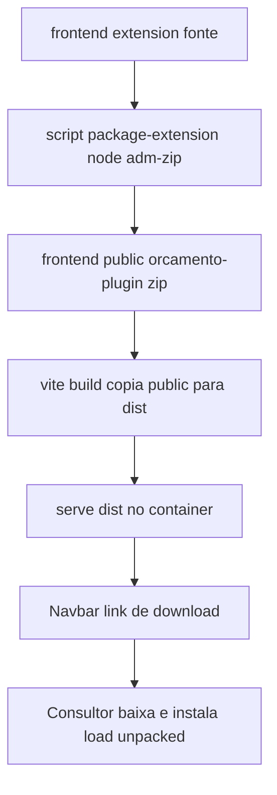
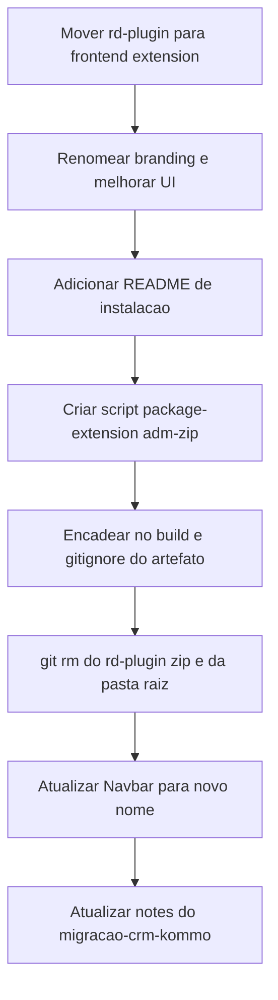

# Design Document — plugin-distribuicao

## Overview

**Propósito**: padronizar o empacotamento e a distribuição da extensão de navegador "Orçamento Peraltas" (que abre o orçamento pré-preenchido a partir de um lead do Kommo), de modo que o download servido pelo frontend seja sempre a versão atual do código, sem reempacotamento manual, e que a extensão deixe de carregar o nome do RD e o IP fixo.

**Usuários**: consultores comerciais (baixam/instalam a extensão) e o mantenedor (publica atualizações via CI).

**Impacto**: move o fonte da extensão de `rd-plugin/` (raiz) para **`frontend/extension/`** (dentro do contexto de build do frontend), adiciona um passo de empacotamento no build do frontend que gera o `.zip` a partir do fonte, remove o `.zip` estático versionado, e atualiza o ponto de download e o branding. Como o empacotamento passa a fazer parte do `yarn build` (executado pelo Dockerfile), a imagem do frontend fica **self-contained** e o CI (`docker-build.yml`) não precisa de passo extra.

### Goals
- Extensão renomeada para "Orçamento Peraltas" (nome, pasta, zip, label do download), sem referências ao RD, com UI do popup melhorada.
- Download no frontend sempre na versão atual, empacotada automaticamente no build.
- Destino do app pelo domínio `https://orcamento.grupoperaltas.com.br` (ponto único de config).
- Guia de instalação ("load unpacked") incluído no zip baixado.
- Sem regressão da lógica (extrair lead, abrir hospedagem/corporativo/lista).

### Non-Goals
- Publicação na Chrome Web Store e auto-update via loja.
- Provisionamento de DNS/HTTPS e deploy.
- Alteração da lógica funcional do plugin.

## Boundary Commitments

### This Spec Owns
- O fonte da extensão em `frontend/extension/` (manifesto, popup, script, branding, README de instalação).
- O passo de empacotamento (script Node) que gera `frontend/public/<zip>` a partir do fonte, integrado ao `build` do frontend.
- O ponto de download no `Navbar` e o nome/rótulo do artefato.
- A remoção do `.zip` estático versionado e a regra de gitignore do artefato gerado.

### Out of Boundary
- Lógica funcional do plugin (extração de lead-id, abertura dos fluxos) — preservada, não reescrita.
- Chrome Web Store / auto-update.
- DNS/HTTPS/infra; pipeline de imagens em si (`docker-build.yml`) permanece sem passo de plugin.

### Allowed Dependencies
- Frontend (React+Vite), seu `package.json`/Dockerfile, `Navbar`.
- Nova devDependency de empacotamento: `adm-zip` (zip multiplataforma em Node; `node:20-alpine` não traz `zip`).
- **Proibido**: reintroduzir IP fixo; versionar o `.zip` como binário; acoplar token/API do CRM na extensão.

### Revalidation Triggers
- Mudança do nome do artefato/zip ou do `href` de download → revalidar `Navbar` e qualquer link externo.
- Mudança do padrão de URL de lead do Kommo ou do `APP_BASE` → revalidar a extensão.
- Mudança do contexto de build do frontend (`./frontend`) → revalidar o passo de empacotamento.

## Architecture

### Existing Architecture Analysis
- Frontend Vite: `public/*` é copiado as-is para `dist/` no `vite build`; a imagem (`frontend/Dockerfile`) faz `COPY . .` → `yarn build` → `serve -s dist`. Logo, o que estiver em `frontend/public/` no build é servido.
- CI `docker-build.yml` builda com `context: ./frontend` — o plugin na raiz não é alcançável pelo build da imagem (origem do zip manual).
- A extensão (de `migracao-crm-kommo` task 4.1) é vanilla JS (manifest MV3, popup, `script.js` com `extractLeadId` + 3 fluxos, `extractLeadId.test.js`).

### Fluxo de empacotamento



**Decisões-chave**:
- **Empacotamento no `build`**: o script roda como parte de `yarn build` (encadeado no script `build`, não via hook `prebuild`, para não depender do comportamento de lifecycle do yarn). Assim CI e build local usam o mesmo mecanismo; a imagem é self-contained.
- **`adm-zip`** em vez do binário `zip` (ausente no alpine) → comportamento idêntico em qualquer ambiente.
- **Fonte dentro de `frontend/`**: coloca a extensão no contexto de build, eliminando passo de CI.
- **Artefato não versionado**: `frontend/public/orcamento-plugin.zip` é gerado no build e gitignorado; o `rd-plugin.zip` antigo é removido do git.

### Technology Stack

| Layer | Choice / Version | Role | Notes |
|-------|------------------|------|-------|
| Extensão | Chrome MV3 (vanilla JS) | popup + abrir app | movida para `frontend/extension/` |
| Empacotamento | `adm-zip` (^0.5) em Node | gerar o `.zip` no build | substitui `zip` (ausente no alpine) |
| Frontend build | Vite (existente) | copia `public/<zip>` → `dist` | `build` encadeia o empacotamento |
| CI | `docker-build.yml` (existente) | build/push da imagem | **sem alteração** (build já empacota) |

## File Structure Plan

### Novos / movidos
```
frontend/
├── extension/                      # fonte da extensão (movido de rd-plugin/)
│   ├── manifest.json               # name "Orçamento Peraltas"; host_permissions Kommo
│   ├── script.js                   # APP_BASE = DNS; extractLeadId + 3 fluxos (inalterado)
│   ├── index.html                  # popup com UI melhorada
│   ├── style.css                   # estilo do popup
│   ├── extractLeadId.test.js       # teste node (excluído do zip)
│   └── README.md                   # guia de instalação "load unpacked" (incluído no zip)
└── scripts/
    └── package-extension.mjs       # adm-zip: zipa extension/ (exceto *.test.js) -> public/orcamento-plugin.zip
```

### Modificados
- `frontend/package.json` — `build` encadeia `node scripts/package-extension.mjs`; adiciona devDep `adm-zip`; (opcional) script `package:plugin`.
- `frontend/src/components/Navbar/index.tsx` — `href='/orcamento-plugin.zip'`, `download='Orcamento-Peraltas'`, sem texto "RD".
- `frontend/.gitignore` — ignorar `public/orcamento-plugin.zip`.

### Removidos
- `rd-plugin/` (pasta inteira na raiz; conteúdo movido).
- `frontend/public/rd-plugin.zip` (binário versionado; `git rm`).

## Components and Interfaces

| Component | Domain/Layer | Intent | Req | Contracts |
|-----------|--------------|--------|-----|-----------|
| package-extension.mjs | Build/script | Empacota a extensão em zip | 3,4 | Batch |
| frontend/extension/* | Browser ext | Plugin renomeado + UI + README | 1,2,5,6 | — |
| Navbar | Frontend/UI | Ponto único de download | 1,4 | — |

#### package-extension.mjs
**Contracts**: Batch ✔
- Trigger: executado por `yarn build` (e manualmente via `node scripts/package-extension.mjs`).
- Input: o diretório `frontend/extension/` (exceto arquivos `*.test.js`).
- Output: `frontend/public/orcamento-plugin.zip` (sobrescrito a cada execução).
- Idempotência: regenera o zip do zero a cada run; saída determinística a partir do fonte.
- Falha: se o fonte estiver ausente/ilegível ou o zip não puder ser escrito, o script sai com código ≠ 0 → falha o `build` (Req 3.4).

**Implementation Notes**
- Incluir `README.md` no zip (guia); excluir `*.test.js`.
- Não embutir segredos; conteúdo é só o fonte estático da extensão.

## Error Handling
- **Empacotamento (Req 3.4)**: o script valida a existência do fonte e trata erro de escrita; qualquer falha → `process.exit(1)`, quebrando o build (CI falha visível, sem publicar zip ausente/velho).
- **Download (Req 4)**: como o zip é gerado no build, um build bem-sucedido garante o artefato presente; não há caminho de "zip ausente" numa imagem publicada.

## Testing Strategy

### Unit / Build Tests
- `package-extension`: executar o script e verificar (via `adm-zip`) que o zip foi criado em `public/`, contém `manifest.json` e `script.js`, inclui o `README.md` e **não** inclui `*.test.js` (Req 3.1, 5.1).
- `extractLeadId`: o teste node existente continua passando após o move (`node frontend/extension/extractLeadId.test.js`) — guarda Req 6.1/6.3.

### Integration / Manual
- `yarn build` no frontend gera `dist/orcamento-plugin.zip` servível (Req 3.2, 4.1).
- Verificação manual: carregar o zip "load unpacked", abrir um lead do Kommo, acionar os 3 botões → app abre nos fluxos corretos no domínio de produção (Req 2.1, 6.2); fora de lead → no-op (Req 6.3).
- Branding: o popup e a extensão exibem "Orçamento Peraltas", sem "RD" (Req 1).

## Migration Strategy

- Rollback: como o `.zip` antigo sai do git e o novo é gerado no build, reverter = restaurar a pasta/zip antigos; baixo risco (mudança de empacotamento, não de lógica).
